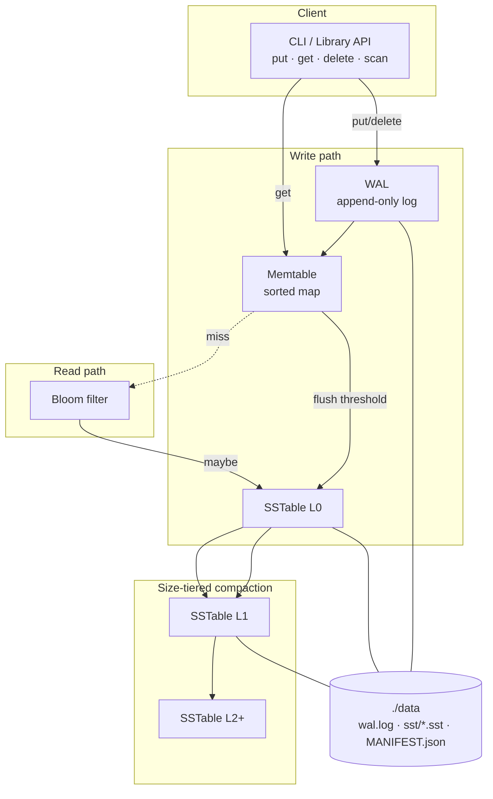

# lumen-kv

**Educational LSM-tree key-value store from scratch in TypeScript.**

[](https://github.com/SK090347/lumen-kv/actions/workflows/ci.yml)
[](LICENSE)
[](LICENSE-APACHE)

> Built by [Sumit Kumar Ta](https://github.com/SK090347) as a portfolio systems project — whiteboard LSM design, then an actual Node.js implementation.

No SQLite wrapping. No LevelDB bindings. Pure Node.js + TypeScript implementing the classic **Log-Structured Merge-Tree** write path.

---

## Mathematics / Formulation

Writes append to a WAL and land in an in-memory **memtable**. When the memtable hits a flush threshold, it becomes an immutable **SSTable** on disk. Reads probe memtable → L0…Lk SSTs (newest sequence wins). Compaction merges runs to control amplification.

### Amplification tradeoffs

| Metric | Informal definition | Typical LSM behavior |
|--------|---------------------|----------------------|
| Write amp | Bytes written to disk / logical bytes ingested | $> 1$ (compaction rewrites) |
| Read amp | SST / bloom probes per `get` | Memtable + up to $\#$ overlapping runs |
| Space amp | Bytes on disk / live logical data | Tombstones until compacted |

Point lookup cost with a sparse index is roughly $O(\log n)$ index steps + one I/O per candidate SST (Bloom filters skip most negatives).

### Bloom filter false-positive rate

With $m$ bits, $n$ keys, $k$ hash functions (Kirsch–Mitzenmacher double hashing):

$$
\mathrm{FPR} \approx \bigl(1 - e^{-kn/m}\bigr)^{k}
$$

Optimal $k \approx (m/n)\ln 2$. Filters are false-negative free: “no” means the key is absent.

### Sequence resolution

Each put/delete gets a monotonic sequence number $s$. On merge / read, for key $k$ keep the record with maximal $s$; tombstones suppress older values until deep compaction GC.

**Why this formula?** LSM math is about *amplification*, not a single closed PDE — recruiters want to see you can quantify write/read/space tradeoffs and Bloom FPR, then wire memtable → SST → compaction.

---

## Why LSM (vs B-trees)?

| | **B-tree** (InnoDB, LMDB) | **LSM-tree** (LevelDB, RocksDB, Cassandra) |
|---|---|---|
| Writes | In-place page updates → random I/O | Append-only → sequential I/O |
| Write amp | Lower for updates-in-place | Higher (compaction rewrites data) |
| Read amp | Typically 1–3 page reads | Memtable + multiple SSTs (mitigated by Bloom) |
| Space amp | Modest fragmentation | Tombstones until compacted |
| Best for | Read-heavy / point lookups | Write-heavy / ingest pipelines |

**lumen-kv** teaches the LSM side: memtable → WAL → flush → SSTables → size-tiered compaction → Bloom-filtered reads.

---

## Architecture



### Compaction strategy: **size-tiered**

When any level accumulates `compactionThreshold` SSTables (default **4**), they are k-way merged into **one** SSTable on `level + 1`. Newest sequence number wins. Tombstones are dropped when merging into level ≥ 2 (educational GC heuristic).

*Why size-tiered over leveled?* Fewer interlocking invariants — ideal for learning. Leveled compaction (LevelDB) keeps non-overlapping key ranges per level and trades higher write amplification for lower read amplification.

---

## Quick start

```bash
git clone https://github.com/SK090347/lumen-kv.git
cd lumen-kv
npm install
npm test
npm run build

# CLI demo
npm run cli -- demo
npm run cli -- put hello world
npm run cli -- get hello
npm run cli -- scan
npm run cli -- stats
```

Library usage:

```ts
import { LumenDB } from 'lumen-kv';

const db = new LumenDB({
  dataDir: './data',
  memtableFlushThreshold: 1000,
  compactionThreshold: 4,
  bloomFilter: true,
});

await db.open();
await db.put('user:1', 'alice');
console.log(await db.get('user:1')); // alice
await db.delete('user:1');
await db.close();
```

---

## Components

| Module | Role | Complexity notes |
|---|---|---|
| `Memtable` | In-memory sorted map (skip-list *API*, binary-search key array) | Get O(1) avg via `Map`; ordered insert O(n) splice — fine at ~1k flush size. Production: skip list $O(\log n)$. |
| `WAL` | Length-prefixed binary records; replay on open; checkpoint after flush | Append O(1); recovery O(bytes) |
| `SSTable` | Immutable sorted file + sparse index + Bloom | Point lookup $O(\log n)$ index + 1 I/O; scan $O(n)$ |
| `BloomFilter` | Double-hashing (Kirsch–Mitzenmacher) over SHA-256 seeds | False-negative free; tunable FPR |
| `compaction` | Size-tiered k-way merge by key/seq | Merge $O(N \log k)$ with materialization for clarity |
| `LumenDB` | Orchestrates open / put / get / delete / scan / flush | Sequence numbers resolve multi-SST conflicts |

---

### On-disk layout (`./data`)

```
data/
  wal.log
  MANIFEST.json          # next SST id + sequence
  sst/
    L0-000001.sst
    L1-000005.sst
    ...
```

SST header: magic `LMN1` → version → counts → Bloom bytes → index offset → data block → key/offset index.

---

## Systems skills demonstrated

- **Durability & recovery** — WAL before memtable mutation; crash replay restores unflushed writes
- **Immutable data structures on disk** — SSTables, atomic rename for publish
- **Merge algorithms** — k-way sorted merge with sequence-number conflict resolution
- **Probabilistic filters** — Bloom membership to cut pointless SST I/O
- **Tombstones & GC** — soft deletes that survive until deep compaction
- **Binary protocols** — length-prefixed records, endian-aware buffers
- **Engineering hygiene** — Vitest suite, GitHub Actions CI (Node 18/20/22), dual MIT + Apache-2.0, typed public API

---

## Test coverage (must-pass scenarios)

```bash
npm test
```

- WAL recovery of puts + deletes; checkpoint truncation
- SST round-trip including tombstones; Bloom never false-negatives
- `mergeSorted` / `compactLevel` correctness (highest seq wins)
- End-to-end flush → reopen → get; crash mid-memtable; L0 compaction under load

---

## Project layout

```
src/
  types.ts        Entry / options
  memtable.ts     Sorted memtable
  wal.ts          Write-ahead log
  bloom.ts        Bloom filter
  sstable.ts      SST writer/reader
  compaction.ts   Size-tiered compaction
  db.ts           LumenDB engine
  cli.ts          `lumen` CLI
  index.ts        Public exports
tests/            Vitest suites
.github/workflows/ci.yml
```

---

---

## License

Dual-licensed under **MIT** OR **Apache-2.0** — see [LICENSE](LICENSE), [LICENSE-APACHE](LICENSE-APACHE), and [NOTICE](NOTICE).

## Author

**Sumit Kumar Ta** ([SK090347](https://github.com/SK090347))

## Topics

`lsm` · `key-value-store` · `typescript` · `database` · `systems` · `portfolio`
